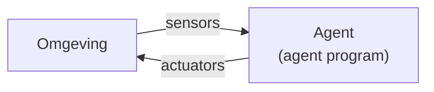
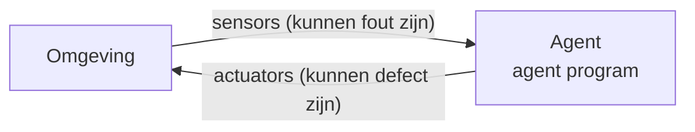
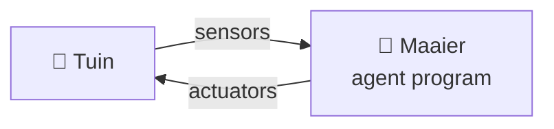
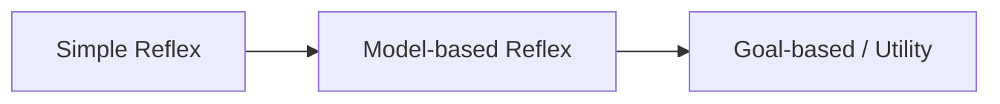
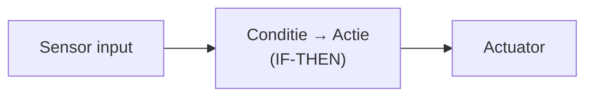
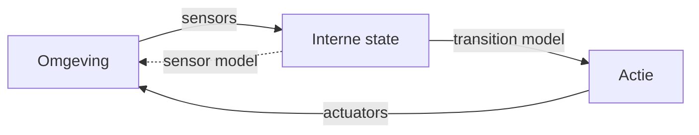

<!-- _class: title-slide -->

# Les 1 — AI vs ML
## Wat is het verschil?

---

<!-- _class: red-bg -->

# Intelligente agents

Een belangrijk denkkader

---

## Wat is een agent?

- Een agent is een systeem dat via **sensors** informatie binnenkrijgt uit zijn **omgeving**
- Op basis van die informatie en **interne logica** (het *agent program*) voert de agent via **actuators** acties uit
- Doel: de situatie in de omgeving verbeteren

---

## Sensors & Actuators — fouten

Zowel het observeren als het ageren kunnen fout gaan:

- Een **sensor** kan fout meten
- Een **actuator** kan een motor aansturen met als doel vooruit te gaan, maar als die motor een technisch defect heeft, blijf je alsnog staan

---

<!-- _class: interest-slide -->

## Een foutieve sensor — Boeing 737 Max

> *"Flawed information from a single external sensor fed into the system caused it to repeatedly push the planes' noses down as pilots struggled to keep them in the air before both crashes."*
> — [Wikipedia — Boeing 737 MAX](https://en.wikipedia.org/wiki/Boeing_737_MAX)

- **Single point of failure** in één sensor → leidde tot **2 vliegtuigcrashes** met bijna **350 doden**
- Netflix-documentaire: *"Downfall: The Case Against Boeing"*

---

<!-- _class: red-bg -->

# Agent function

---

## Agent function

- Een agent wordt bepaald door zijn **agent function**
- Voor elke mogelijke reeks inputs kunnen we bepalen wat de agent moet doen → een **state-action tabel**
- In de praktijk is die tabel **gigantisch**, soms zelfs **oneindig groot**

| Huidige staat | Actie |
|---|---|
| (gras, plaats) | Maaien |
| (niet gemaaid, plaats) | Rechtdoor |
| (gemaaid, plaats) | Links |
| (gemaaid, geen plaats) | … |

---

## State-action tabel — onhaalbaar groot

- Voor **schaken**: $10^{154}$ entries
- Ter vergelijking: aantal atomen in het universum ≈ $10^{80}$
- De state-action tabel is een **fata morgana**: ziet er fantastisch uit, maar kan in realiteit niet bestaan!

> Een agent function is de **theoretische** werking van een agent — een ideaal dat we in de praktijk benaderen.

---

## Voorbeeld — robotgrasmaaier

- Een robotgrasmaaier moet beslissen of hij **rechtdoor, links, rechts, achteruit** gaat, **stopt**, of de **maaier aan/uit** zet
- De omgeving — je tuin — geeft informatie:
  - Als de maaier **van het gras** rijdt → links, rechts of achteruit
- De robot past de omgeving aan: uiteindelijk is heel de tuin gemaaid

---

## Wat is AI in dit framework?

- De taak van **AI** is het ontwerpen van een **agent program** dat de agent function implementeert
- Dit is dus **concrete code**, geschreven voor een specifieke set actuatoren en sensors — de **agent architecture**
- Het heeft geen zin aan geavanceerd beeldherkenning te doen als er geen camera is!
- Deze cursus gaat over **agent programs**: hoe ontwerp en vergelijk je ze?

---

<!-- _class: red-bg -->

# Rationele Agents

---

## Wat maakt een agent rationeel?

- Voor elke geobserveerde input moet de agent handelen zodat zijn **doelfunctie** wordt gemaximaliseerd
- We hebben een **doelfunctie** (performance measure) nodig die bepaalt hoe goed een agent bezig is

**Voorbeeld — grasmaaier:**
- Doel: (zo snel mogelijk) de hele tuin maaien
- Doelfunctie: het percentage reeds gemaaid gras
- Een grasmaaier die in rondjes draait en stukken overslaat, is **niet rationeel**

---

## Rationele Agents — voorwaarden

Een rationele agent:

- ✅ Houdt rekening met **geobserveerde data** en **ingebouwde kennis**
- ❌ Is **niet alleswetend** — een autonoom voertuig kan niet weten dat er een niet-geconnecteerde auto achter de hoek met 100 km/u het kruispunt nadert. **Rationeel ≠ alleswetend!**
- ✅ Kan **leren** uit de historiek van inputs
- ✅ Doet dit **autonoom**

**Voorbeeld — 2 types robotmaaiers:**
1. Kent de vorm van de tuin **op voorhand**
2. Kent de tuin **niet** en moet deze eerst leren → tweede keer sneller

---

<!-- _class: red-bg -->

# Task environment

---

## Task environment — PEAS

Een agent kan enkel geëvalueerd worden op basis van de taak waarvoor hij is ontworpen:

- **P** — **P**erformance measure (doelfunctie)
- **E** — **E**nvironment (omgeving)
- **A** — **A**ctuators (wat het systeem kan aansturen)
- **S** — **S**ensors (wat het systeem kan waarnemen)

> De problemen = task environments; de agents = de oplossingen.

---

## PEAS — Robotmaaier

| Onderdeel | Beschrijving |
|---|---|
| **Performance** | Gras maaien, veiligheid, minimaal energieverbruik, minimale menselijke tussenkomst |
| **Environment** | Grasveld, bomen, planten, dieren (dynamisch), weersomstandigheden |
| **Actuators** | Sturen, banden (rechtdoor/achteruit), maaier aan/uit, waarschuwingslicht |
| **Sensors** | Hoogte gras, weerstand op wielen, navigatie t.o.v. basisstation, batterij, nabijheidssensor, temperatuur, vochtigheid |

---

## PEAS — OCR-paspoortscanner

| Onderdeel | Beschrijving |
|---|---|
| **Performance** | Foto automatisch omzetten naar beeld, minimale correctie via keyboard |
| **Environment** | Linux bestandssysteem; inputfolder met JPG/PNG (max 25 MB), outputfolder (max 10 GB), 4 GB RAM |
| **Actuators** | Files wegschrijven naar disk, resultaat weergeven op scherm |
| **Sensors** | Camera, keyboard input registratie |

---

<!-- _class: red-bg -->

# Soorten problemen

Welke eigenschappen hebben de problemen die we oplossen?

---

## Overzicht eigenschappen

| Eigenschap | Mogelijkheden |
|---|---|
| **Observeerbaarheid** | Volledig vs. Partieel |
| **Aantal agents** | Single vs. Multi (competitief / coöperatief) |
| **Zekerheid** | Deterministisch vs. Stochastisch |
| **Tijdsverloop** | Episodisch vs. Sequentieel |
| **Dynamiek** | Statisch vs. Dynamisch |
| **Waarden** | Discreet vs. Continu |

---

## Volledig vs. Partieel observeerbaar

**Volledig observeerbaar** (perfect information):
- Schaken, dammen, Go, Monopoly, Mens-erger-je-niet

**Partieel observeerbaar** (imperfect information):
- Poker, Patience

---

## Single vs. Multi-agent

| Type | Voorbeelden |
|---|---|
| **Single** | Kruiswoordraadsel, Patience |
| **Multi — 2-player (competitief)** | Schaken, dammen, Go |
| **Multi-agent (coöperatief)** | Zelfrijdende auto's, Scrabble, Monopoly |

---

## Deterministisch vs. Stochastisch

| Type | Kenmerk | Voorbeelden |
|---|---|---|
| **Deterministisch** | Geen onzekerheid | Schaken, dammen, Go |
| **Stochastisch** | Kansfactor (dobbelsteen) | Mens-erger-je-niet, Monopoly |

---

## Episodisch vs. Sequentieel

| Type | Kenmerk | Voorbeelden |
|---|---|---|
| **Episodisch** | Elke ronde onafhankelijk | Schaar-steen-papier, Roulette |
| **Sequentieel** | Vorige stappen beïnvloeden volgende | Lottotrekking (zonder teruglegging) |

---

## Statisch vs. Dynamisch

| Type | Kenmerk | Voorbeelden |
|---|---|---|
| **Statisch** | Omgeving verandert niet tijdens zet | Schaken (zonder klok), puzzels |
| **Dynamisch** | Omgeving verandert tijdens zet | Race- en schietspellen |
| **Semi-dynamisch** | Enkel performantiescore wijzigt met tijd | Schaken met klok, escape games |

---

## Discreet vs. Continu

| Type | Kenmerk | Voorbeelden |
|---|---|---|
| **Discreet** | Eindig aantal opties | Schaken, dammen, Go, bordspellen |
| **Continu** | Oneindig veel mogelijkheden | Autonomous driving, camera-detectie |

> Strikt genomen is een camera discreet ($256^3$ ≈ 16 miljoen kleuren), maar voor het blote oog is dat **continu**.

---

<!-- _class: red-bg -->

# Agent Programs

---

## Soorten agentprogramma's

De uitdaging voor AI: een programma schrijven dat een **rationele agent** oplevert **zonder** de hele state-action tabel te definiëren.

Drie basistypes:

1. **Simple Reflex agents**
2. **Model-based Reflex agents**
3. **Goal-based agents** / **Utility agents**

---

## Simple Reflex agents

- Handelen op basis van **huidige sensor input** — geen geheugen van het verleden
- Set regels: **conditie → actie** (IF → THEN)
- Eenvoudig, maar **beperkt intelligent**

**Voorbeelden bij mensen:**
- Hand terugtrekken bij verbranding
- Oog sluiten bij naderend voorwerp

---

<!-- _class: interest-slide -->

## Simple Reflex agents — beperking

Deze agents komen snel in de problemen bij **partieel observeerbare** situaties.

**Voorbeeld:** de sphex-wesp kan de geschiedenis van het verleden **niet** omzetten in slimmer gedrag.

▶️ [Bekijk de video](https://www.youtube.com/watch?v=YNvi_j2z96w)

---

## Model-based Reflex agents

- Houden in hun **geheugen** bij wat ze momenteel **niet kunnen waarnemen**
- Hebben een **interne state** → kunnen veranderingen over tijd vaststellen
- **Transition model:** weet wat het effect is van hun acties
- **Sensor model:** weet hoe veranderingen in de omgeving worden gereflecteerd door sensormetingen
- Bij elke nieuwe input wordt de interne state geüpdatet

---

## Model-based Reflex — voorbeelden

**Robotgrasmaaier:**
- Houdt een **kaart** bij van de tuin — waar is hij al geweest?
- **Transition model:** als de linkermotor harder draait dan de rechtermotor, stuurt de robot naar rechts

**Uitdaging:** bij veel mogelijkheden wordt brute force onmogelijk.

**Voorbeeld — Google Maps:**
- Kiest de optimale route van Antwerpen naar Parijs
- Checkt **niet** alle mogelijke wegen
- Gebruikt het doel "zo snel mogelijk" om een weg via Amsterdam uit te sluiten

---

## Goal-based agents & Utility agents

- Hebben een **doel** dat aangeeft of nieuwe situaties wenselijk zijn
- Geen "reflex" meer — de agent probeert de state **dichter bij het einddoel** te brengen
- Flexibeler dan reflex agents

**Twee varianten:**
| Type | Omschrijving |
|---|---|
| **Goal-based** | Enkel het einddoel is gekend |
| **Utility-based** | Interne **utility-functie** die wordt gemaximaliseerd — elke tussenpositie krijgt een score |

---

## Goal vs. Utility — voorbeeld

**Goal — route Antwerpen → Parijs:**
- Vind een **pad** dat start in Antwerpen en eindigt in Parijs
- Een pad = een rij steden met een weg ertussen

**Utility functie:**
$$-d(\text{huidige stad}, \text{nieuwe stad})$$

- Dit wil je **zo groot mogelijk** hebben
- Dus: een **zo klein mogelijke afstand** ($d$ = distance)

---

<!-- _class: red-bg -->

# Sorteren

Even een opfrissing

---

## Wat is sorteren?

- Het **ordenen** van een lijst op basis van een vergelijkingsmethode:
  - $<$ of $>$
  - Alfabetisch
  - Chronologisch
- Sorteren wordt al sinds de jaren 1950 bestudeerd
- Recent nog **nieuwe algoritmes** populair (o.a. Timsort, 2002)

---

<!-- _class: red-bg -->

# Complexiteit van algoritmes

---

## Hoe vergelijken we algoritmes?

- Een algoritme wordt **trager** naarmate er meer data is
- Afhankelijk van het systeem kan het sneller/trager gaan
- Sommige problemen zijn **parallelliseerbaar**, andere niet

---

## Big O-notatie

Dient om algoritmes onderling te vergelijken op:

- **Tijdsefficiëntie**
- **Geheugengebruik** (space complexity)

| Notatie | Betekenis |
|---|---|
| $O(1)$ | Wordt niet trager bij meer input |
| $O(n)$ | Dubbel zoveel input → dubbel zo traag |
| $O(n^2)$ | Dubbel zoveel input → $2^2 = 4\times$ trager |
| $O(b^d)$ | branchingfactor $b$ tot de macht diepte $d$ |

---

## Voorbeeld: 2 sorteeralgoritmes

| Eigenschap | Bubble Sort | Merge Sort |
|---|---|---|
| Complexiteit | $O(n^2)$ | $O(n \log n)$ |
| Geheugen | $O(1)$ | $O(n)$ |
| Stabiliteit | ✅ | ✅ |

---

## Voorbeeld: sorteeralgoritmes demo

---

## Verschillende sorteeralgoritmes

- **Insertion sort** — zien we in het labo
- **Quicksort** — zoals de naam het zegt, erg snel
- **Tree sort** — specifiek voor lijsten waar items worden toegevoegd
- **Timsort** (2002) — de standaard in Python en Java
- …

> Op Wikipedia vind je een goede overzichtstabel met alle eigenschappen per sorteeralgoritme.

